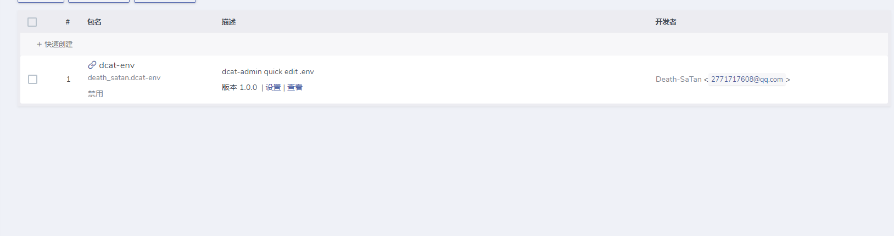
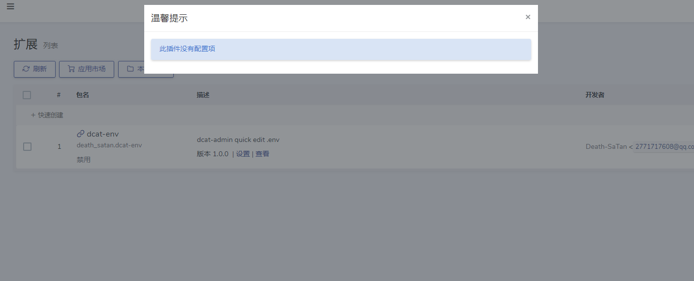
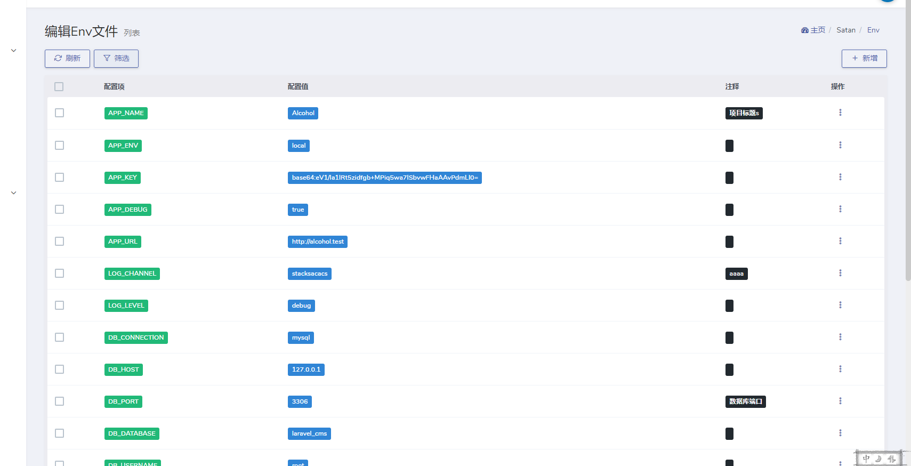
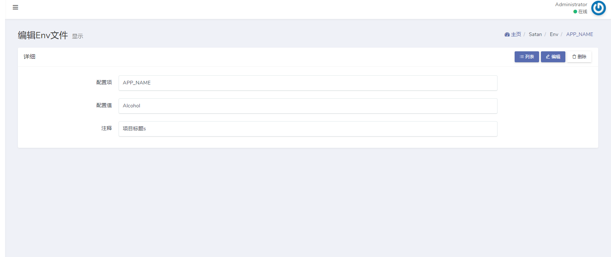
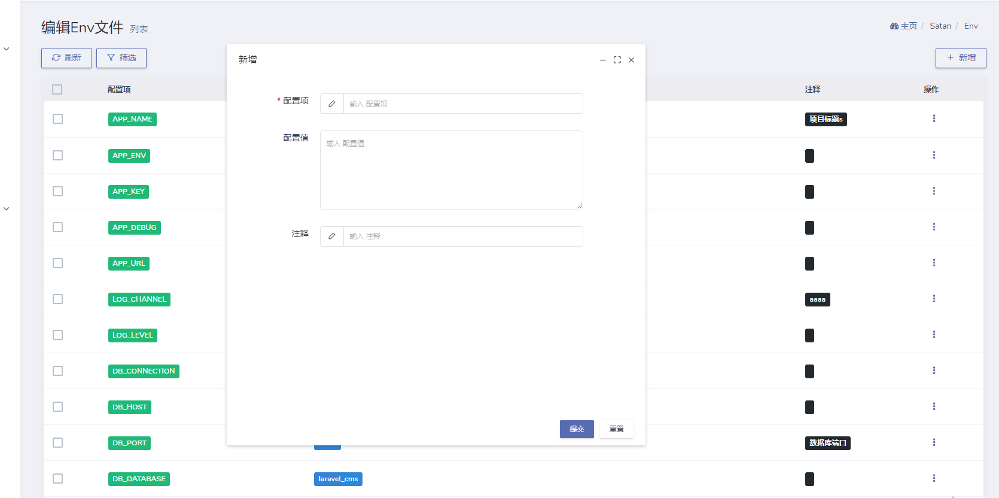
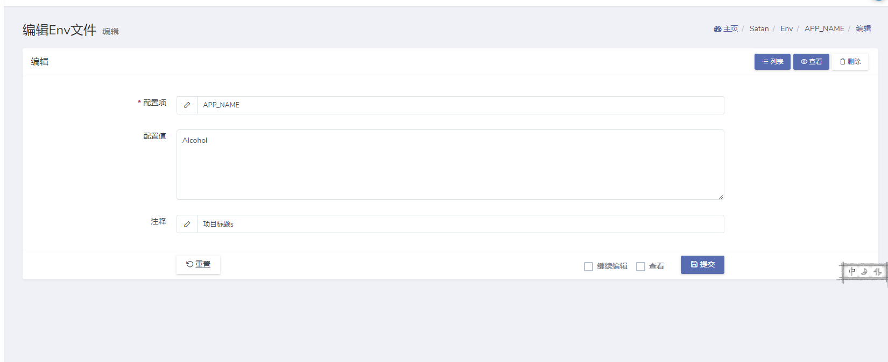
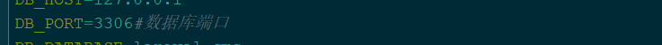
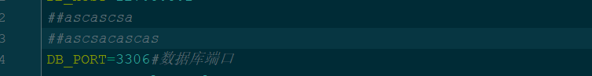

# Dcat Admin env文件管理

# 安装

## composer

---

```shell
composer require death_satan/dcat-env
```

---

## 扩展压缩包

---

```shell
#暂无
```

---

## 通过 `http://yourdomain/admin/auth/extensions` 插件管理页面更新插件

---


---


---

# 页面截图(使用grid+show+form)

## grid(查询)

---


---

## show 详情

---


---

## form(新增和修改)

---


---


---

## 仅支持单行注释

---


---

## 不支持多行注释

---


---
